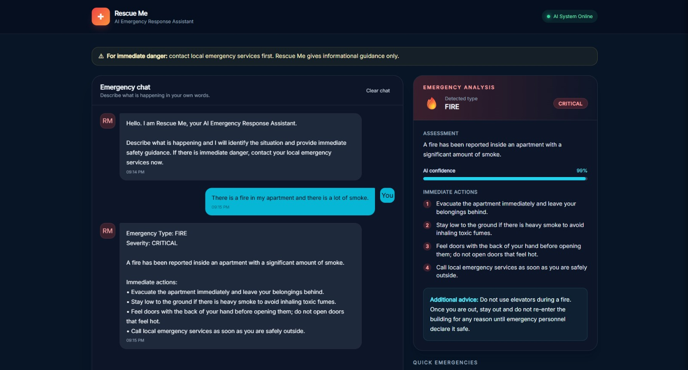
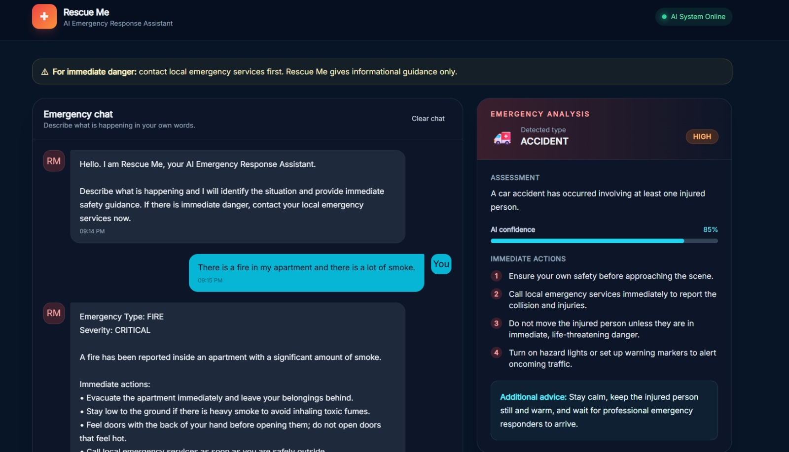

# 🚨 RescueMe — AI Emergency Response Assistant

## 📌 Overview

RescueMe is a college CIA prototype inspired by the research paper:

**"Rescue Me: AI Emergency Response and Disaster Management System."**

This project implements the **AI/NLP emergency-response chatbot** component, where users describe an emergency and receive its type, severity, and safety recommendations.

---

## 📸 Application

### Dashboard



### Emergency Analysis



---


## 🎥 Demo Walkthrough

The demo demonstrates:

- Fire emergency
- Accident emergency
- AI classification
- Severity analysis
- Safety recommendations

**Demo Video:**  
[▶️ Watch Demo Video](demo/RescueMe-Demo.mp4)

---

## 🛠️ Tech Stack

- **Frontend:** React, Vite, Tailwind CSS
- **Backend:** Java 17, Spring Boot, Maven
- **AI:** Google Gemini API

---

## 🏗️ Architecture

```text
User
  ↓
React Frontend
  ↓
Java Spring Boot
  ↓
Gemini AI
  ↓
Emergency Analysis
  ↓
React Dashboard